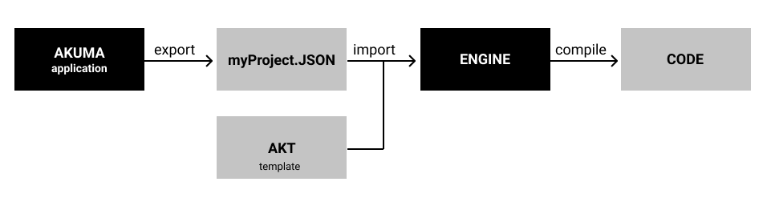

## About Akuma

Akuma is a open source project to create projects using model and templates to generate code by engines.

## Akuma application

Is not startted yet. Anyone interesting in participate this project please contact on Linkedin. [here](https://www.linkedin.com/in/julio-contreras-6579b623/) 

## Akuma template

[Akuma Extension VSCODE](https://github.com/julioacontreras/akuma-template-extension-vscode)

[Akuma Template Language](https://github.com/julioacontreras/akuma-project/tree/main/language)

## Akuma engine

Link github to start creating your project. [here](https://github.com/julioacontreras/akuma-engine)

